# MERMELADA

**Dificultad:** Principiante

**Plataforma:** The Hackers Labs

**SO:** Linux


## Reconocimiento Inicial

### **Escaneo de puertos con nmap**

```
nmap -p- -Pn -sVC  --min-rate 5000 192.168.50.30
```


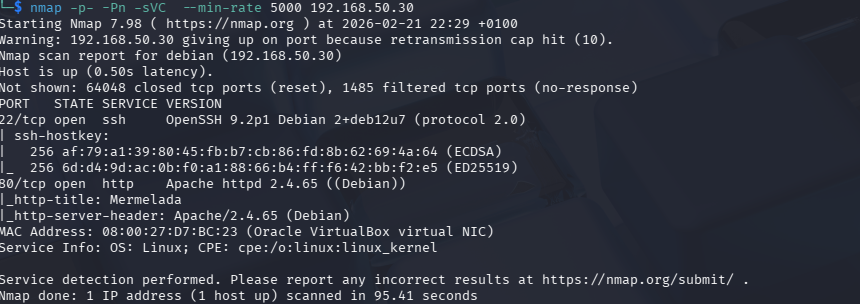

Resultado del escaneo

Puerto 80 - HTTP

Puerto 22 - SSH

Realizo ping para comprobar conectividad e identificar SO.
Comprobando que en la máquina corre windows de acuerdo con el TTL

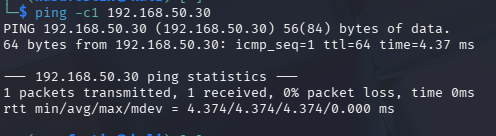

Veo que corre en el puerto 80 por si encuentro algo interesante,se detecta página de una empresa dedicada a la fabricación de mermelada

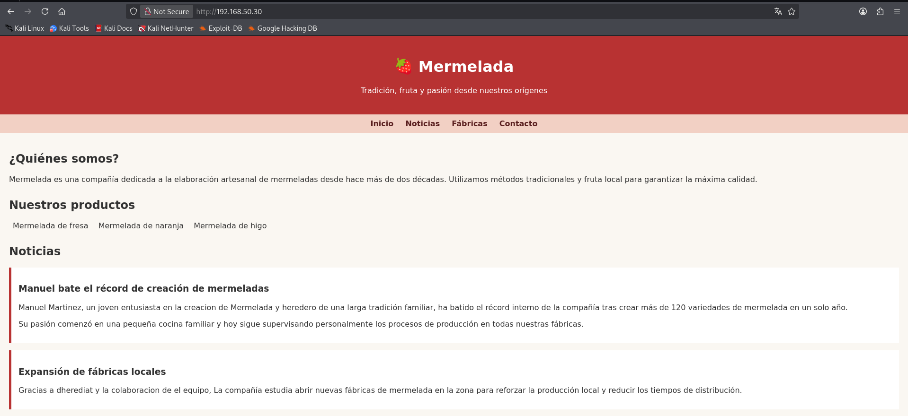

## Enumeración web 

### Fuzzing de archivos y directorios

```gobuster dir -u http://192.168.50.30 -w /usr/share/wordlists/dirbuster/directory-list-2.3-medium.txt js,html,php,txt -t 200```

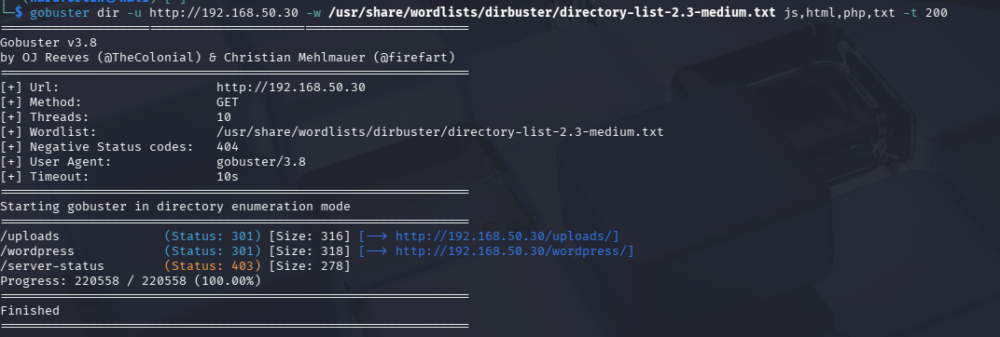


Accedo al directorio /upload sin encontrar nada interesante

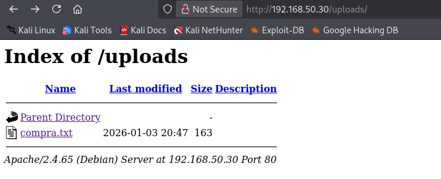

Accedo también al directorio /wordpress

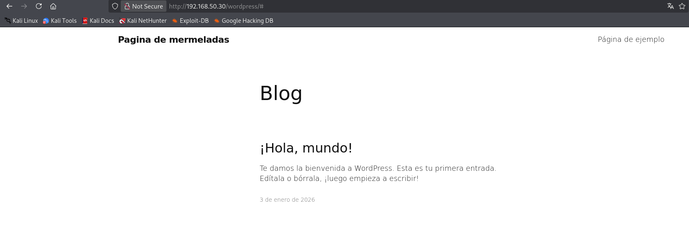

Realizo un escaneo WPScan

```wpscan --url http://192.168.50.30/wordpress  -e u vp vt```


Encuentro varias cosas destacables

1.XML-RCP - Permite: comunicación remota con Wordpress mediante XML sobre HTTP

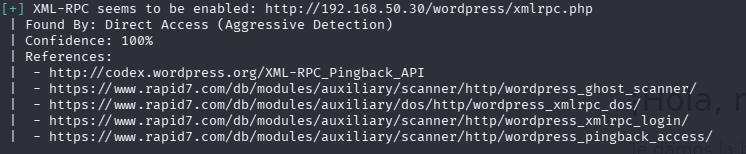


2./wp-content/uploads/ - Upload Directory Listing, permite: enumerar archivos subidos, buscar archivos sensibles y reconocimiento de la estructura del sitio.


3.Usuario (mermeladita).Posible acceso


Intento sacar la contraseña para el usuario "mermeladita" mediante XML-RPC sin exito 

Lo siguiente 
es explorar el wp-content/uploads

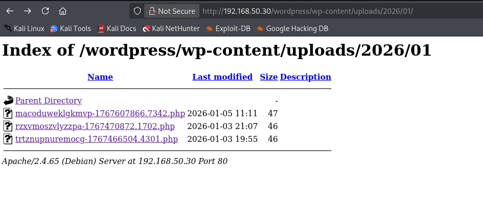

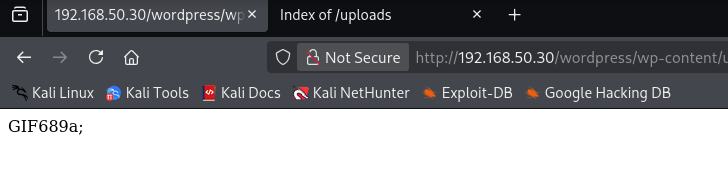

Obtengo el panel de subida de archivos Wordpress, con algunos archivos subidos, posiblemente de pruebas.

Reconocimiento de los archivos existentes

Probar cada archivo para ver qué hacen

```bash
curl -v http://192.168.50.30/wordpress/wp-content/uploads/2026/01/macoduweklgkmvp-1767607866.7342.php
curl -v http://192.168.50.30/wordpress/wp-content/uploads/2026/01/rzxvmoszvllyzzpa-176740872.1702.php
curl -v http://192.168.50.30/wordpress/wp-content/uploads/2026/01/trtznnpunremocg-1767466504.4301.php
```

Lo que me devuelve es que esos archivos ya no existen, han sido renombrados o eliminados.

Busco vectores de subida en wordpress

```bash
curl "http://192.168.50.30/wordpress/wp-content/uploads/2026/01/macoduweklgkmvp-1767607866.7342.php?cmd=id"
curl "http://192.168.50.30/wordpress/wp-content/uploads/2026/01/macoduweklgkmvp-1767607866.7342.php?c=whoami"
curl "http://192.168.50.30/wordpress/wp-content/uploads/2026/01/macoduweklgkmvp-1767607866.7342.php?ejecutar=ls"
```


Probamos la ejecución de los comandos con ?cmd=id como forma estandar de probar webshells y el servidor nos devuelve:

uid=33(www-data) gid=33(www-data) groups=33(www-data)

Estoy ejecutando comandos www-data, por lo tanto con accseso al sistema

Lo siguiente es obtener una reverse shell

Establezco en mi máquina un puerto de escucha

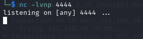

Creo una reverse shell entre mi máquina y la víctima


Tengo acceso al sistema


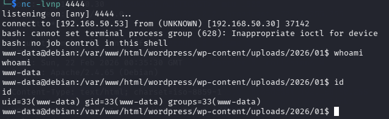

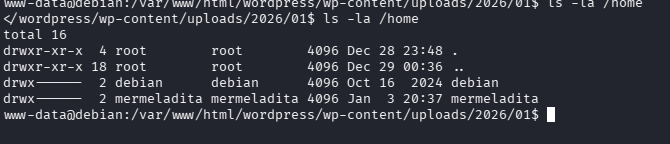

Listo archivos de /home y veo que hay dos usuarios "mermeladita" que ya conociamos y "debian", por lo que realizo ataque de fuerza bruta con Hydra a este nuevo usurio


```
hydra -l debian -P /usr/share/wordlists/rockyou.txt ssh://192.168.50.30 -t 4
```


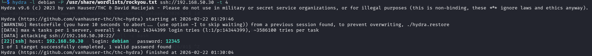

El ataque nos devuelve la contraseña 12345 para el usuario debian


### Acceso mediante SSH

Ya con las credenciales accedo mediante SSH

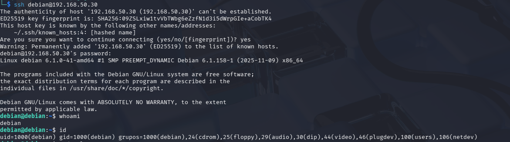


Una vez dentro, exploro el sistema en busca de alguna vulnerabilidad que pueda explotar


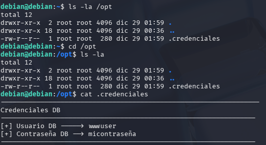

Veo si corre mysql y pruebo con las credenciales pero el usuario no tiene acceso a base de datos interesantes

Busco en archivos de configuración de Wordpress


```bash
cat /var/www/html/wordpress/wp-config.php
```

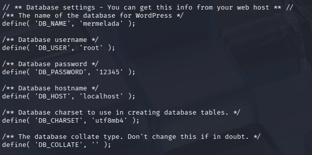


Consigo las credenciales Mysql para el usuario "root" y contraseña "12345"

Accedo a Mysql

```bash
mysql -u root -p12345 
```

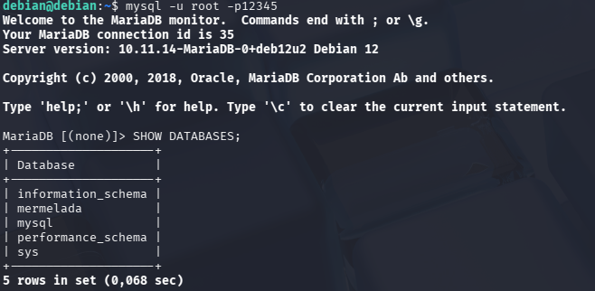

Uso la base de datos de Wordpress

USE mermelada;

USE TABLES;

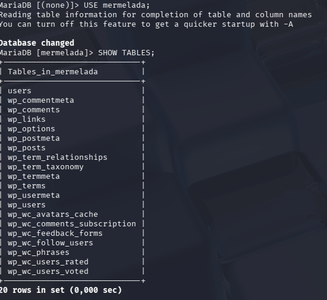


Encuentro una tabla "users"

SELECT * FROM users;


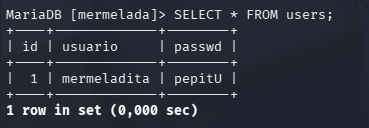

Tengo las credenciales para el usuario "mermeladita" y la contraseña "pepitU"


Cambio de usuario a mermeladita

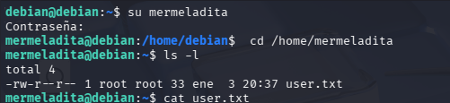

Tengo la flag de usuario

### Escalada de privilegios

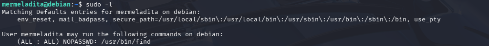


Puedo ejecutar /usr/bin/find como root sin contraseña, para lo cual consulto GTFOBins

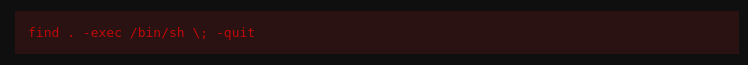

Ejecuto el payload como sudo y tengo shell como root

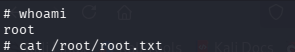

Flag de root conseguida.


